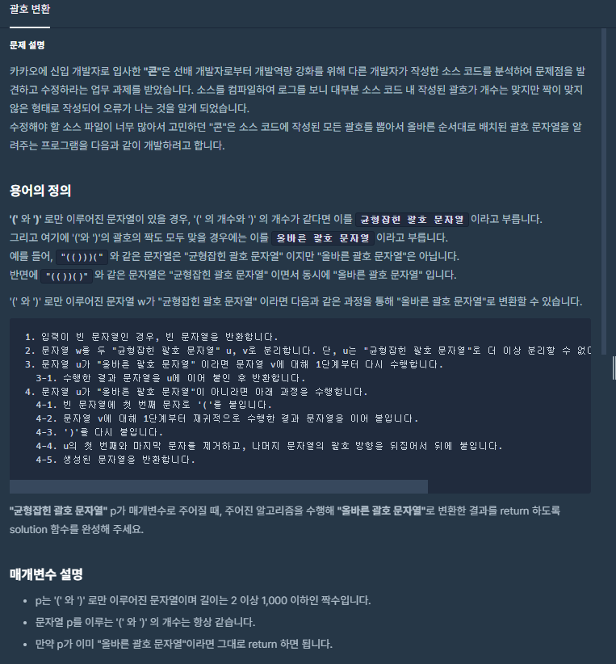

### 소스 코드
```js
function solution(p) {
    let answer = "";
    let left = 0 // 현재 왼쪽 괄호 개수
    let right = 0; // 현재 오른쪽 괄호 개수
    let check = false; // '올바른 괄호' 유무 체크

    if (p.length == 0) {
        return ""
    }
    for (let i = 0; i < p.length; i++) {

        if (p[i] == '(') left++;
        if (p[i] == ')') right++;
        //오른쪽괄호가 왼쪽괄호보다 많으면 올바른 괄호가 아님        
        if (right > left) check = true;
        if (left == right) {
            // '올바른 괄호' X
            if (check == true) {
                console.log('잘못된')
                answer += '(';
                answer += solution(p.slice(i + 1, p.length));
                answer += ')';
                console.log(answer)
                for (let j = 1; j < i; j++) {
                    if (p[j] == ')') answer += '(';
                    if (p[j] == '(') answer += ')';
                }
                return answer;
            }

            // '올바른 괄호' O
            else {
                console.log('올바른')
                answer += p.slice(0, i + 1);
                console.log(answer)
                answer += solution(p.slice(i + 1, p.length));
                console.log(answer)
                return answer;
            }
        }
    }
}
```

### 풀이과정 설명
1. 현재 들어온 문자열의 괄호 숫자를 확인해야하므로 오른쪽/왼쪽 괄호숫자를 확인합니다.
2. 오른쪽 괄호가 왼쪽괄호보다 많으면 문제가 있는 괄호로 판단
3. 왼쪽과 오른쪽의 괄호가 같을때까지 반복한다.
4. 올바른 괄호일 경우 문자열에서 현재 인덱스까지 문자열을 잘라내어 answer에 붙인다.
5. 정의 4-4 요청한 첫번째와 마지막을 제거하기 위해서 1~마지막인덱스를 제외한 나머지에 대해서 반전을하여 문자열 뒤에 붙입니다.
6. 남아 있는 부분에 대해서 재귀를 통해서 다시 괄호 숫자에 대한 검사를 진행.