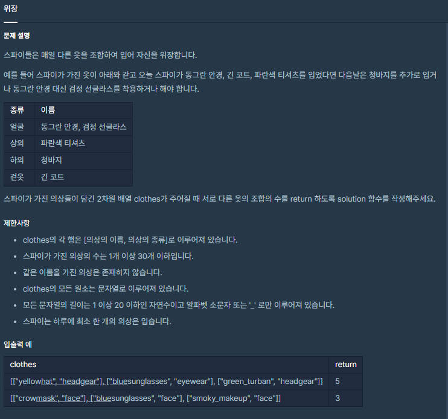

### 소스 코드
```js
function solution(clothes) {
    var answer = 1;
    let maps = new Map();

    for(let i = 0; i < clothes.length; i++)
    {
        let key = clothes[i][1] ;
        maps.set(key,(maps.get(key)? maps.get(key) + 1 : 1 ));
    }
    for(const [key,value] of maps)
        answer *= value+1;

    return answer-1;
}
```

### 풀이과정 설명
받아온 2차원 배열을 보면 [0] 값 [1]이 key로 이루어진것을 알 수 있습니다.<br>
옷의 종류에 따른 조합을 하기 위해서는 각 종류별 옷의 개수를 세어야합니다.<br> 
그래서 Map 객체를 통해서 key별로 분류하되 값은 개수를 세기 위하여 1로 치환하여 저장하고 기존에 값이있을경우 +1

고려해야할 사항으로는 해당 옷종류를 입지 않는 경우도 존재합니다.<br>
그렇기 때문에 각 옷 종류별로 경우의 수를 +1을 하여 옷의 종류 별로 곱셈을 하여 최종적으로 옷의 조합가능한 개수를 산출한다.

예외사항으로 모든 옷을 안입는 케이스가 있기 때문에 제한사항의 최소 한개의 의상을 입는 부분을 고려하여 

최종결과에서 -1을 한다.