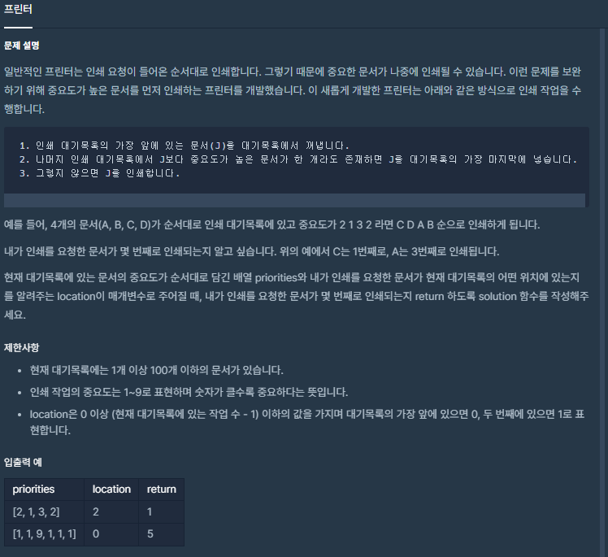

### 소스 코드
```js
function solution(priorities, location) {
    var answer = 0;
    //배열의 길이가 0이상일때까지 반복
    while (priorities.length > 0)
    {
        console.log(location)
        //배열의 첫번째 요소 
        let first = priorities.shift();
        //첫번쨰 요소보다 큰 요소가 있는지 필터를 통해 검사 
        let data = priorities.filter(el => el > first)
        //첫번째 요소보다 큰 요소가 있을 경우 push를 통해 가장 뒤에 위치
        if(data.length > 0)
            priorities.push(first)
        //첫번째 요소보다 큰 요소가 없을 경우 인쇄순서 +1 , 현재 순서가 0번째 일 경우 내가 뽑으려는 문서므로 함수종료
        else
        {
            //인쇄 순서 +하면서 배열은 잘려나감.
            answer++
            if(location == 0) return answer;
        }
        //순서 -1
        location--;
        //순서가 0이하 일 경우 배열의 제일 뒷자리로 location 변경
        if(location < 0)
            location = priorities.length -1
    }
    return answer;
}

```

### 풀이과정 설명
풀이는 배열의 길이가 0이 될때까지 반복하며, 배열의 첫번째 요소값 기준으로 
남아있는 배열에서 첫번쨰 요소값보다 큰 값이 있는지 필터를 통해 검사 후 없는 경우 인쇄 카운트를 1씩 올리고 
잘려진 배열 기준으로 다시 검사를 진행하는 식으로 진행하였습니다. 0이 되기전 내가 원하는 문서가 출력될 경우 
즉시 반복문을 종료하고 함수 종료를 진행하도록 하였습니다. 
