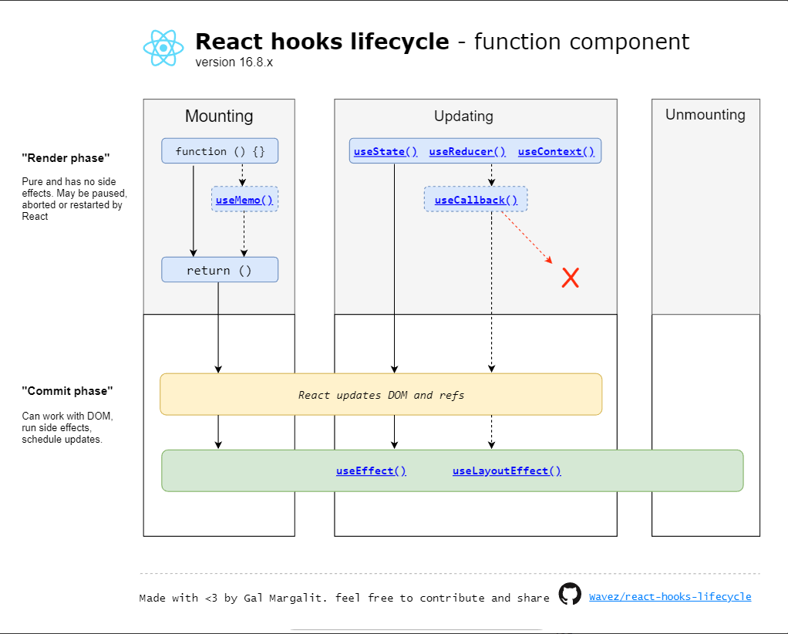

## 📆 2022년 4월 1주차 WIL

### 🌱 공부하면서 배운 점 정리

#### 라이프 사이클

#### 클래스형 컴포넌트

- 클래스형 컴포넌트의 생성주기는 크게 생성 될때, 업데이트할때, 제거할때 이렇게 3개로 나눌수 있다. 

1. 생성될 때 (compoentdidmount)
   1. 컴포넌트의 생성을 결정하는 constructor를 선언
2. 업데이트할 때(componetdidupdate)
   1. props가 바뀔 때 
   2. state가 바뀔 때 
   3. 부모 컴포넌트가 리렌더링 될 때 
   4. this.forceUpdate로 강제로 렌더링을 트리거할 때
3. 제거할때 (compoentdidunmount)
   1. 컴포넌트가 종료될 때

#### 함수형 컴포넌트

 - 함수형 컴포넌트의 생성주기는 클래스형과 다르게 생성될때, 업데이트할때, 2개로 나눌 수 있다. 
 - 제거할때가 없는 이유는 함수형 컴포넌트는 업데이트할때, 제거도 같이 진행되는 훅이 있기때문. 

1. 생성될때
2. 업데이트 될때
   1. useEffect() 훅을 통해서 컴포넌트에안에서 state,props에 접근이 가능하며 그 이후에 모든 업데이트시 
   useEffect()안에 있는 내용이 실행됩니다. 
   2. 컴포넌트 종료시 useEffect()에 있는 return 내용이 실행되어 제거(정리)를 진행합니다.

#### react hook

#### 리액트훅(React hooks)이란?
- Hooks 는 리액트 v16.8 에 새로 도입된 기능이다. 함수형태의 컴포넌트에서 사용되는 기술을 Hook이라고 부른다.
- 함수형 컴포넌트가 클래스형 컴포넌트의 작업을 사용할 수 있도록 해주는 기능
- 클래스형의 단점을 개선하기 위해 함수형 컴포넌트

#### 클래스형 컴포넌트의 단점
1. 코드가 길고 복잡함.
- constructor, this, binding 등 지켜야 할 규칙이 많아서 코드가 복잡하고 길어집니다.
  JAVA처럼 OOP(Object-oriented programming)의 테크닉을 수려하게 적용하지는 않으면서도 
  근본은 클래스의 모습을 가지고있습니다.
  클래스 자체가 Life Cycle method로 인해 기본적으로 코드의 양이 많습니다.
- 
2. Logic의 재사용이 어려움
- 클래스형 컴포넌트에서는 부분적인 DOM 처리나 API,state를 다루는 Logic에 대해서는 
  경우에 따라 2개이상의 LifeCycle에 중복하여 넣어야하는 등의 재사용의 제약

#### 결론
1. 리액트 훅의 등장으로 함수에서 클래스형 컴포넌트의 작업이 가능하게됨.

